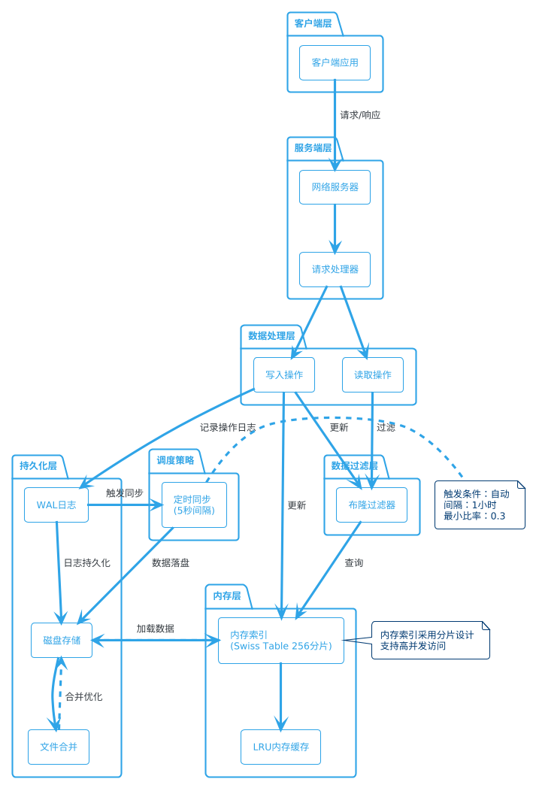
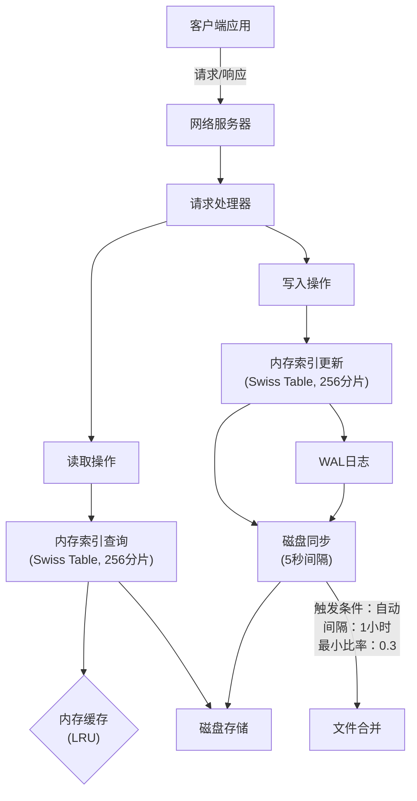

# FinKV

FinKV 是一个高性能的键值存储系统，采用 Bitcask 存储模型，支持 Redis 协议，支持集群部署，具有多层存储架构和灵活的配置选项。

## 项目特性

- **高性能**：采用内存索引 + 顺序写入的 Bitcask 模型
- **可靠性**：支持 WAL 日志和定期磁盘同步
- **兼容性**：支持 Redis 协议，可作为 Redis 的替代品
- **可扩展**：模块化设计，易于扩展新功能
- **可配置**：丰富的配置选项，适应不同场景需求
- **分布式**：基于 Raft 协议实现的分布式一致性，支持集群部署


## 架构设计

FinKV 采用多层架构设计，主要包括：

1. **网络层**：处理客户端连接和协议解析
2. **命令处理层**：解析和执行客户端命令
3. **数据库层**：管理数据结构和操作
4. **存储引擎层**：提供持久化存储能力
5. **分布式层**：基于 Raft 协议实现的分布式一致性


### 存储架构

FinKV 存储引擎基于 Bitcask 模型实现，具有以下特点：

- 内存中保存所有键到文件位置的映射（MemIndex）
- 写操作追加到活动文件，不进行原地更新
- 读操作先查内存索引，再从磁盘读取(布隆过滤器能够过滤一些请求)
- 支持后台合并（Merge）操作，回收空间


### 分布式架构
FinKV 使用自定义实现的 Raft 协议来保证分布式环境下的数据一致性：

- Leader 选举 ：通过投票机制选举集群 Leader
- 日志复制 ：Leader 将写操作日志复制到所有 Follower 节点
- 状态机 ：将已提交的日志应用到状态机，保证各节点数据一致
- 持久化 ：日志持久化到磁盘，确保节点重启后的一致性
- 集群管理 ：支持节点动态加入和退出 Raft 协议实现特点
- 角色管理 ：节点可以是 Leader、Follower 或 Candidate
- 任期机制 ：使用递增的任期号（Term）来检测过期信息
- 心跳机制 ：Leader 定期发送心跳保持权威
- 投票机制 ：基于最新日志判断的投票策略
- 日志同步 ：支持增量和全量日志复制
- 日志压缩 ：使用 gob 编码实现日志压缩存储


## FinKV 存储库流程图
### FinKV 架构与流程

FinKV 是一个键值存储系统，具有多层存储架构和灵活的配置选项。以下流程图展示了系统的主要组件和数据流向。






## 使用

### 启动
#### 单机模式下启动
```bash
go run ./FinKV/cmd/main.go
```

#### 集群模式下启动
节点1
```bash
go run ./FinKV/cmd/main.go -raftID node1 -raft_addr 127.0.0.1:8040
```

节点2(需要指定配置文件，不然会与节点1的默认配置冲突，配置文件主要修改data_dir和network.addr)
```bash
go run ./FinKV/cmd/main.go -conf conf2.yaml  -raftID node2 -raft_addr 127.0.0.1:8041 -join_addr 127.0.0.1:8040
```

节点3...(与节点类似)...


也可以自行build后使用

```bash
go build -o FinKV.exe ./FinKV/cmd/main.go 
```


### 连接

可以直接使用redis-cli连接


### 代码架构
```text
.
├── cluster                  // 集群相关实现
│   ├── command              // 命令处理
│   │   ├── command.go       // 命令基础接口定义
│   │   ├── hash.go          // 哈希类型命令实现
│   │   └── string.go        // 字符串类型命令实现
│   ├── fsm                  // 有限状态机
│   │   └── fsm.go           // 状态机实现，用于应用 Raft 日志到数据库
│   ├── node                 // 节点管理
│   │   └── node.go          // 节点定义与管理
│   └── raft                 // Raft 共识算法实现
│       ├── api.go           // Raft 对外接口
│       ├── fsm.go           // Raft 状态机接口
│       ├── heat.go          // 心跳相关实现
│       ├── log.go           // 日志复制与管理
│       ├── raft.go          // Raft 核心实现
│       └── vote.go          // 选举投票实现
├── cmd                      // 命令行工具
│   ├── client.go            // 客户端实现，连接服务器执行命令
│   └── main.go              // 服务器入口，初始化配置与启动服务
├── config                   // 配置管理
│   └── config.go            // 配置加载与解析
├── database                 // 数据库实现
│   ├── base                 // 基础数据库接口
│   │   ├── batch.go         // 批量操作接口
│   │   ├── db.go            // 数据库基础接口
│   │   └── options.go       // 数据库选项
│   ├── db.go                // 数据库实现
│   └── redis                // Redis 数据类型实现
│       ├── common.go        // 通用功能
│       ├── hash.go          // 哈希类型实现
│       ├── list.go          // 列表类型实现
│       ├── string.go        // 字符串类型实现
│       └── util.go          // 工具函数
├── err_def                  // 错误定义
│   └── errors.go            // 自定义错误类型
├── network                  // 网络通信
│   ├── conn                 // 连接管理
│   │   └── conn.go          // 连接处理
│   ├── handler              // 请求处理
│   │   └── handler.go       // 请求处理器
│   ├── protocol             // 协议实现
│   │   └── resp.go          // Redis 协议实现
│   └── server               // 服务器
│       ├── server.go        // 服务器实现
│       └── stats.go         // 服务器统计信息
├── storage                  // 存储引擎
│   ├── bitcask              // Bitcask 存储引擎
│   │   └── bitcask.go       // Bitcask 实现
│   ├── cache                // 缓存实现
│   │   └── lru.go           // LRU 缓存
│   ├── file_manager         // 文件管理
│   │   └── file_manager.go  // 文件管理器
│   ├── index                // 索引实现
│   │   ├── memindex.go      // 内存索引
│   │   └── swiss_index.go   // Swiss 表索引
│   ├── options.go           // 存储选项
│   ├── storage.go           // 存储接口
│   └── types.go             // 存储类型定义
├── util                     // 工具函数
│   └── util.go              // 通用工具函数
├── conf.yaml                // 配置文件
├── conf2.yaml               // 节点2配置文件
├── go.mod                   // Go 模块定义
├── go.sum                   // Go 依赖校验
└── logo.txt                 // 项目 Logo
```