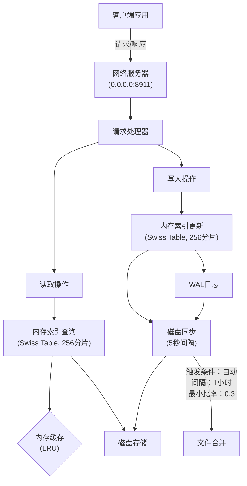
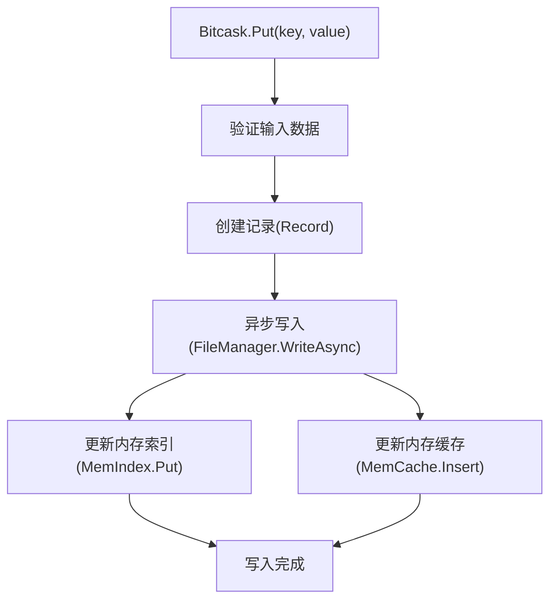
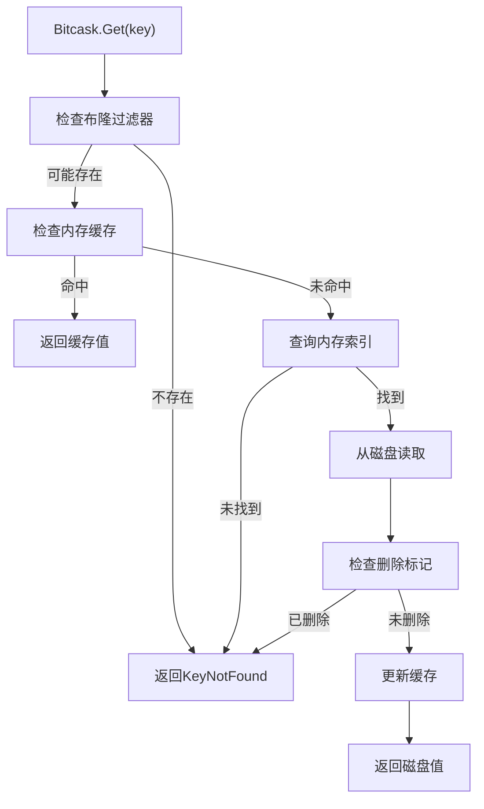

# FinKV

FinKV 是一个高性能的键值存储系统，采用 Bitcask 存储模型，支持 Redis 协议，具有多层存储架构和灵活的配置选项。

## 项目特性

- **高性能**：采用内存索引 + 顺序写入的 Bitcask 模型
- **可靠性**：支持 WAL 日志和定期磁盘同步
- **兼容性**：支持 Redis 协议，可作为 Redis 的替代品
- **可扩展**：模块化设计，易于扩展新功能
- **可配置**：丰富的配置选项，适应不同场景需求

## 架构设计

FinKV 采用多层架构设计，主要包括：

1. **网络层**：处理客户端连接和协议解析
2. **命令处理层**：解析和执行客户端命令
3. **数据库层**：管理数据结构和操作
4. **存储引擎层**：提供持久化存储能力

### 存储架构

FinKV 存储引擎基于 Bitcask 模型实现，具有以下特点：

- 内存中保存所有键到文件位置的映射（MemIndex）
- 写操作追加到活动文件，不进行原地更新
- 读操作先查内存索引，再从磁盘读取
- 支持后台合并（Merge）操作，回收空间

## FinKV 存储库流程图
### FinKV 架构与流程

FinKV 是一个键值存储系统，具有多层存储架构和灵活的配置选项。以下流程图展示了系统的主要组件和数据流向。

