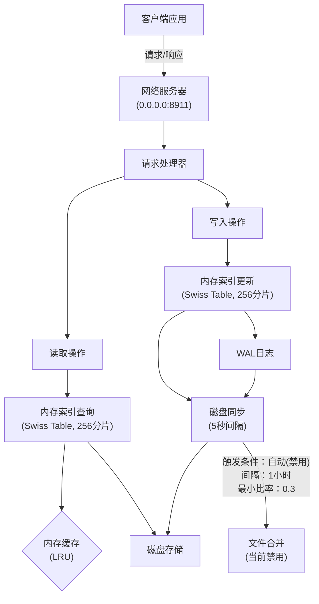
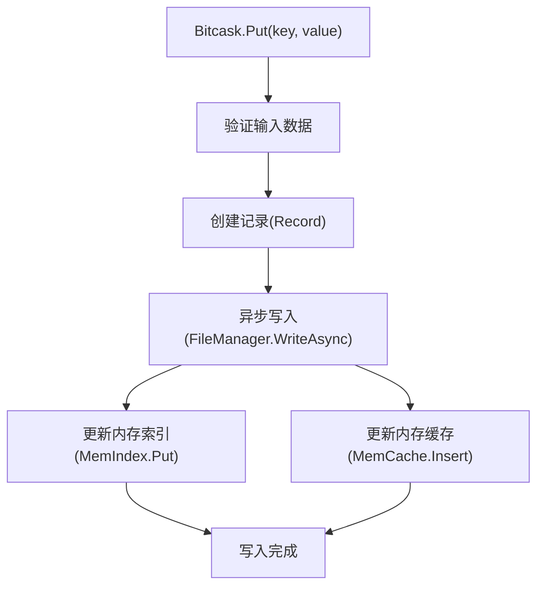

# FinKV 存储库流程图

## FinKV 架构与流程

FinKV 是一个键值存储系统，具有多层存储架构和灵活的配置选项。以下流程图展示了系统的主要组件和数据流向。

```mermaid
graph TD
    Client["客户端应用"] --"请求/响应"--> Server["网络服务器<br/>(0.0.0.0:8911)"]
    Server --> RequestHandler["请求处理器"]
    
    RequestHandler --> ReadOp["读取操作"]
    RequestHandler --> WriteOp["写入操作"]
    
    ReadOp --> MemIndex["内存索引查询<br/>(Swiss Table, 256分片)"]
    WriteOp --> MemIndexUpdate["内存索引更新<br/>(Swiss Table, 256分片)"]
    
    MemIndex --> MemCache{"内存缓存<br/>(LRU)"}
    MemIndex --> DiskStorage["磁盘存储"]
    
    MemIndexUpdate --> WAL["WAL日志"]
    MemIndexUpdate --> DiskSync["磁盘同步<br/>(5秒间隔)"]
    
    WAL --> DiskSync
    DiskSync --> DiskStorage
    
    DiskSync --"触发条件：自动(禁用)<br/>间隔：1小时<br/>最小比率：0.3"--> FileMerge["文件合并<br/>(当前禁用)"]
```

```mermaid
graph TD
    Put["Bitcask.Put(key, value)"] --> ValidateInput["验证输入数据"]
    ValidateInput --> CreateRecord["创建记录(Record)"]
    CreateRecord --> WriteAsync["异步写入(FileManager.WriteAsync)"]
    WriteAsync --> UpdateIndex["更新内存索引(MemIndex.Put)"]
    WriteAsync --> UpdateCache["更新内存缓存(MemCache.Insert)"]
    UpdateIndex --> Complete["写入完成"]
    UpdateCache --> Complete
```

